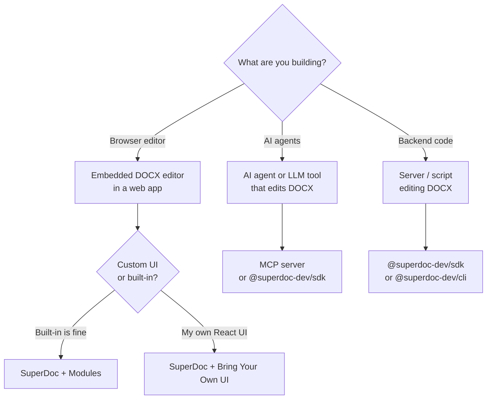

## Pick your surface



Each branch below maps to a specific section.

## Using an AI coding agent?

Run this first. It generates an AGENTS.md that teaches your agent how to use SuperDoc.

```bash
npx @superdoc-dev/create
```

Then set up the MCP server so your agent can edit DOCX files directly:

<Tabs>
  <Tab title="Claude Code">
    ```bash
    claude mcp add superdoc -- npx @superdoc-dev/mcp
    ```
  </Tab>
  <Tab title="Cursor">
    Add to `~/.cursor/mcp.json`:

    ```json
    {
      "mcpServers": {
        "superdoc": {
          "command": "npx",
          "args": ["@superdoc-dev/mcp"]
        }
      }
    }
    ```
  </Tab>
  <Tab title="Windsurf">
    Add to `~/.codeium/windsurf/mcp_config.json`:

    ```json
    {
      "mcpServers": {
        "superdoc": {
          "command": "npx",
          "args": ["@superdoc-dev/mcp"]
        }
      }
    }
    ```
  </Tab>
</Tabs>

Done. Ask your agent to open a `.docx` file and make an edit.

[MCP setup guide →](/document-engine/ai-agents/mcp-server) · [LLM tools →](/document-engine/ai-agents/llm-tools)

---

## Edit DOCX from backend code

<Tabs>
  <Tab title="Node.js">
    ```bash
    npm install @superdoc-dev/sdk
    ```

    ```typescript
    import { SuperDocClient } from '@superdoc-dev/sdk';

    const client = new SuperDocClient({ defaultChangeMode: 'tracked' });
    const doc = await client.open({ doc: './contract.docx' });

    // query, edit, format, comment, track changes...

    await doc.save();
    await doc.close();
    ```
  </Tab>
  <Tab title="Python">
    ```bash
    pip install superdoc-sdk
    ```

    ```python
    from superdoc import SuperDocClient

    client = SuperDocClient(default_change_mode="tracked")
    doc = client.open({"doc": "./contract.docx"})

    # query, edit, format, comment, track changes...

    doc.save()
    doc.close()
    ```
  </Tab>
  <Tab title="CLI">
    ```bash
    npm install -g @superdoc-dev/cli
    ```

    ```bash
    superdoc open contract.docx
    superdoc find --type text --pattern "ACME Corp"
    superdoc replace --target-json '...' --text "NewCo Inc." --change-mode tracked
    superdoc save && superdoc close
    ```
  </Tab>
</Tabs>

[SDK docs →](/document-engine/sdks) · [CLI docs →](/document-engine/cli)

---

## Embed a DOCX editor

<Steps>
  <Step title="Install">
    <Tabs>
      <Tab title="npm">
        ```bash
        npm install superdoc
        ```
      </Tab>
      <Tab title="CDN">
        ```html
        <link href="https://cdn.jsdelivr.net/npm/superdoc/dist/style.css" rel="stylesheet">
        <script src="https://cdn.jsdelivr.net/npm/superdoc/dist/superdoc.min.js"></script>
        ```
        `SuperDoc` becomes a global — use `new SuperDoc({...})` directly.
      </Tab>
    </Tabs>
  </Step>

  <Step title="Mount the editor">
    <Tabs>
      <Tab title="npm">
        ```html
        <div id="editor" style="height: 100vh"></div>

        <script type="module">
          import { SuperDoc } from 'superdoc';
          import 'superdoc/style.css';

          const superdoc = new SuperDoc({
            selector: '#editor',
          });
        </script>
        ```
      </Tab>
      <Tab title="CDN">
        ```html
        <div id="editor" style="height: 100vh"></div>

        <script>
          const superdoc = new SuperDoc({
            selector: '#editor',
          });
        </script>
        ```
      </Tab>
    </Tabs>
    That's a blank editor. Now give it a file.
  </Step>

  <Step title="Load a document">
    Pass a URL, a `File` from an input, or a `Blob` from your API.

    <Tabs>
      <Tab title="URL">
        ```javascript
        new SuperDoc({
          selector: '#editor',
          document: '/files/contract.docx',
        });
        ```
      </Tab>
      <Tab title="File input">
        ```html
        <input type="file" accept=".docx" id="file-input" />
        <div id="editor" style="height: 100vh"></div>

        <script type="module">
          import { SuperDoc } from 'superdoc';
          import 'superdoc/style.css';

          document.getElementById('file-input').addEventListener('change', (e) => {
            new SuperDoc({
              selector: '#editor',
              document: e.target.files[0],
            });
          });
        </script>
        ```
      </Tab>
      <Tab title="Fetch">
        ```javascript
        const response = await fetch('/api/documents/123');
        const blob = await response.blob();

        new SuperDoc({
          selector: '#editor',
          document: new File([blob], 'document.docx'),
        });
        ```
      </Tab>
    </Tabs>
  </Step>
</Steps>

Tracked changes, tables, images, headers/footers — all working.

### Using React?

```jsx
import { SuperDocEditor } from '@superdoc-dev/react';
import '@superdoc-dev/react/style.css';

function App() {
  return <SuperDocEditor document={file} />;
}
```

Install with `npm install @superdoc-dev/react`. [Full React guide →](/getting-started/frameworks/react)

Want a custom toolbar, comments sidebar, or review panel instead of the built-in UI? See [Bring Your Own UI](/bring-your-own-ui/overview).

---

## What's next

<CardGroup cols={2}>
  <Card title="Document Engine" icon="screwdriver-wrench" href="/document-engine/overview">
    Architecture and how to choose a surface
  </Card>
  <Card title="Bring Your Own UI" icon="layout-dashboard" href="/bring-your-own-ui/overview">
    Custom React toolbar, comments, review panel
  </Card>
  <Card title="LLM tools" icon="sparkles" href="/document-engine/ai-agents/llm-tools">
    Build custom AI agents with the SDK
  </Card>
  <Card title="Framework guides" icon="code" href="/getting-started/frameworks/react">
    React, Vue, Angular, Vanilla JS
  </Card>
  <Card title="Examples" icon="arrow-up-right-from-square" href="https://github.com/superdoc-dev/superdoc/tree/main/examples">
    Working demos on GitHub
  </Card>
</CardGroup>
